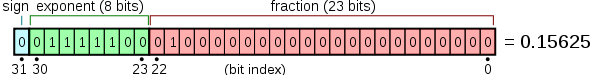
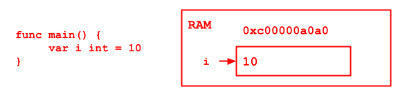
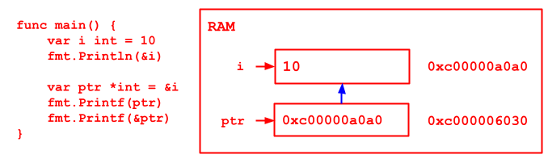

# Chapter 03 Notes - Variable

- Declare
- Assign Value
- Use

## !

1. Variable indicates a storage area in memory
2. The area has its own name (variable name) and type (data type)
3. Three ways to use variable
   - Assign variable data type, without assigning a value, use default value
   - Voluntarily estimate the data type per assigned value
   - Omit var, use `:=` to declare. (If the variable has been declared, `:=` will cause compiling error)
4. Support declare multiple variable at once
   - Global Scope Variable - defined outside the function
5. The value in THE area, could be changed within same data type
6. Cannot use same var name in the same scope
7. Variable = Var name + value + data type
8. If variable not get assigned, use default value

## Data Type

### Basic Data Type

number
- int
   - int int8 int16 int32(rune) int64
   - uint uint8 uint16 uint32 uint64
   - byte
- float
   - float32
   - float64

complex
- complex32
- complex64

char - use byte to save a character

bool - true false

string


### Complex Data Type

- Pointer
- array
- struct
- Channel
- func
- slice
- interface
- map

## int
| type   | byte | range        | 
|--------|------|--------------| 
| int8   | 1    | -128~127     | 
| int16  | 2    | -2^15~2^15-1 | 
| int32  | 4    | -2^31~2^31-1 | 
| int64  | 8    | -2^63~2^63-1 | 
| uint8  | 1    | 0~255        | 
| uint16 | 2    | 0~2^16-1     | 
| uint32 | 4    | 0~2^32-1     | 
| uint64 | 8    | 0~2^64-1     | 

int
- 32 bit system - 4bytes - int32
- 64 bit system - 8bytes - int64

uint
- 32 bit system - 4bytes - uint32
- 64 bit system - 8bytes - uint64

rune - int32 - indicates unicode

byte - unsigned - uint8 - store a character

### Details

1. signed, unsigned - int/uint relates to OS
2. default - int
3. check byte size and data type
   - byte size - `unsafe.Sizeof()`
   - data type - `fmt.Printf("%T", v)`
4. In the premise of code correction, use small size data type (e.g. age)

## float
| type    | byte | range                | 
|---------|------|----------------------| 
| float32 | 4    | -3.403E38~3.403E38   | 
| float64 | 8    | -1.798E308~1.798E308 | 

- floating-point number = sign + exponent + fraction
   
- fraction might missing and causing accuracy loss
   - float64 is more accrue than float32
   - to keep a more accuracy number, use float64

### Details

- float32 and float64 have no impact from OS
- default - float64
- representation
   - decimal - 5.12, .512
   - scientific notation - 5.12e2
- use float64 if possible
   

## Char

Go does not have a specific data type for char, Use `byte` to save the data

String in Go is composed of bytes

1. ASCII -> byte
2. Unicode -> int/uint/rune
3. use Printf("%c", c) to print actual character

### Details
- use `''` to wrap a char
- use escape char to save special char
- Go use UTF-8 variable length
- char is an int, if print directly, output is an int
- char could be calculated

Save: char -> char value -> binary
Read: binary -> char value -> char


## bool

- boolean either `true` or `false`
- 1 byte
- logic calculation -> flow control

## string

string is a character list composed of constant length characters

### Details

- Use UTF-8
- string is a const value, cannot modify
- representation
    - `""` 
    - use `` to wrap special characters
- concat use `+`
- multiple lines: end line with `+`

## BASIC DATA TYPE DEFAULT VALUE

| data type | default value   | 
|-----------|-----------------| 
| int       | 0               | 
| float     | 0               | 
| bool      | false           | 
| string    | "" empty string | 

`Printf("%v", v) // output following the value of the variable`

## BASIC DATA TYPE Conversion

Golang data type cannot auto-convert

use `dataType(orinalValue)`

### Details
- conversion: small <-> large
- the value is the thing get converted, but not the original data type
- int65 -> int8, NO ERROR treat as overflow

### Basic Data Type, string conversion

dt -> str
1. `fmt.Sprintf("%params", expression)`
2. `strconv`
    - FormatBool
    - FormatFloat
    - FormatInt
    - FormatUnit
    - FormatComplex

str -> dt  
- `strconv`
    - ParseBool
    - ParseFloat
    - ParseInt
    - ParseUnit
    - ParseComplex
    
if cannot convert to string will assign default value per data type
(e.g. "string" -> int, will get 0)

## Pointer

1. for basic data type, the value saves the value, or called value type
2. get the ram address of a basic type variable, use `&` e.g. `&num`
   
3. pointer variable save an address, the space that the address pointing is the value
   
4. to get the value that pointer pointing to, sue `*` e.g.`*ptr`

```go
package main
import "fmt"
func main()  {
	// basic data type in RAM
	var i int = 10
	// the ram address of i &i
	fmt.Println("value of i:", i)
	fmt.Println("ram address of i:", &i)

	// 1. ptr is an pointer variable
	// 2. ptr of ptr is *int
	// 3. the value of ptr is &i
	var ptr *int = &i
	fmt.Printf("ptr: %v \n", ptr)
	fmt.Printf("ptr address: %v \n", &ptr)
	fmt.Printf("ptr pointing value: %v\n", *ptr)
}
```
### Details
1. value types have their corresponding pointer data type
    - int -> *int
    - float32 -> *float32
2. value type including
    - int series
    - float series
    - bool
    - string
    - array
    - struct

## Value Types & Reference Types

Value types
- Basic value types
- array
- struct

variable save value directly and ram usually get distributed in the stack
  
Reference Types
- pointer
- slice
- map
- channel
- interface

the variable saves an address and ram usually get distributed in the queue.
If no variable reference this address, then the data space will be GCed


## Identifier

variable name, function name, etc.

naming rules:
- [a-zA-Z0-9_]
- cannot start with number
- case-sensitive
- `_` is a special identifier - **empty identifier** 
    - could stand for any other identifier
    - it's value will be ignored
    - used for placeholder
- cannot use a preserved identifier e.g. break, if, etc. (25 in total) as identifier


### Notice

1. Package name 
    - align with dirname as possible
    - meaningful short and no conflict to standard libs
2. Variable, FUnction, and Const name use camelCase
3. if Variable, FUnction, and Const name start with upper case, then It should be public, else, private
    - see e.g. `go_code/chapter03/variable14_identifier`
    
### Preserved Identifier
|          |             |        |           |        |
|----------|-------------|--------|-----------|--------|
| break    | default     | func   | interface | select |
| case     | defer       | go     | map       | struct |
| chan     | else        | goto   | package   | switch |
| const    | fallthrough | if     | range     | type   |
| continue | for         | import | return    | var    | 

### Predefined Identifier
basic data type & system nested function

|           |            |        |       |         |         | 
|-----------|------------|--------|-------|---------|---------| 
| append    | bool       | byte   | cap   | close   | complex | 
| complex64 | complex128 | uint16 | copy  | false   | float32 | 
| float64   | imag       | int    | int8  | int16   | uint32  | 
| int32     | int64      | itoa   | len   | make    | new     | 
| nil       | panic      | uint64 | print | println | real    | 
| recover   | string     | true   | uint  | uint8   | uintprt | 
