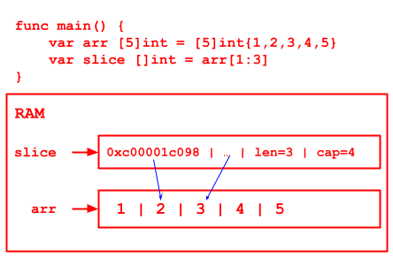

# Chapter07 Notes - Array & Slice

## Array
- Program - maintainable
- Code - readable extendable

### Definition

```
var arrayName [length]dataType
```

`var intArr [3]int`

1. use `&arr` to get the address of the array
2. the address of the first element of the array is the address of the array
3. address of second element is &arr + dataType byte

   here, int is 8 bytes

// 4 ways to init an array
```go
var arrInit1 [3]int = [3]int{1, 2, 3}

var arrInit2 = [3]int{4, 5, 6}

var arrInit3 = [...]int{7, 8, 9}

var arrInit4 = [...]int{1: 800, 0: 700, 2: 1000, 4: 1200}

arrInit5 := [...]string{1: "MY", 0: "OH", 2: "GOD"}
```

### Iteration

1. use `for`
2. use for-range
    ```go
    for index, value := range arr {
        BODY
    }
    ```
    - index is the position [scope: for loop]
    - value is the value [scope: for loop]
    - use `_` to ignore index / value

### Details
!! 

1. array is a collection of same dataType data, the length is static, cannot modify
2. `var arr []int` is a slice, NOT AN ARRAY 
3. array element could be any data type (value, reference), BUT CANNOT MIX
4. if not assign data after declaration: number->0, string->"", bool->false
5. step: 
   1. declare an array and create RAM space
   2. assign value, if not will use default value
   3. use array
6. index start from 0
7. index should limit to array length, otherwise, panic
8. go array is value type, pass by value by default, will copy and pass
   
9. pass by reference to change the array value outside the function
   
10. length of the array is part of the data type, when passing params, we need to consider array length


## Slice

~ dynamic length array

- slice is a reference of array / reference type / follow pass by reference
- array like
- length is dynamic
- declaration: `var slice []int` // no length required
  

- slice is reference type
- slide: struct
  ```go
   type slice struct {
       ptr *[2]int
       len int
       cap int
   }
   ```

