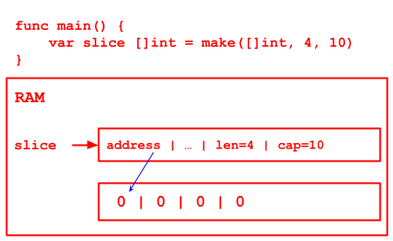

# Chapter07 Notes - Array & Slice

## Array

- Program - maintainable
- Code - readable extendable

### Definition

```
var arrayName [length]dataType
```

`var intArr [3]int`

1. use `&arr` to get the address of the array
2. the address of the first element of the array is the address of the array
3. address of second element is &arr + dataType byte
   
   here, int is 8 bytes

// 4 ways to init an array

```go
var arrInit1 [3]int = [3]int{1, 2, 3}

var arrInit2 = [3]int{4, 5, 6}

var arrInit3 = [...]int{7, 8, 9}

var arrInit4 = [...]int{1: 800, 0: 700, 2: 1000, 4: 1200}

arrInit5 := [...]string{1: "MY", 0: "OH", 2: "GOD"}
```

### Traverse

1. use `for`
2. use for-range
    ```go
    for index, value := range arr {
        BODY
    }
    ```
    - index is the position [scope: for loop]
    - value is the value [scope: for loop]
    - use `_` to ignore index / value

### Details

!!

1. array is a collection of same dataType data, the length is static, cannot modify
2. `var arr []int` is a slice, NOT AN ARRAY
3. array element could be any data type (value, reference), BUT CANNOT MIX
4. if not assign data after declaration: number->0, string->"", bool->false
5. step:
    1. declare an array and create RAM space
    2. assign value, if not will use default value
    3. use array
6. index start from 0
7. index should limit to array length, otherwise, panic
8. go array is value type, pass by value by default, will copy and pass
   
9. pass by reference to change the array value outside the function
   
10. length of the array is part of the data type, when passing params, we need to consider array length

## Slice

~ dynamic length array

- slice is a reference of array / reference type / follow pass by reference
- array like
- length is dynamic
- declaration: `var slice []int` // no length required


- slice is reference type
- slide: struct
  ```go
   type slice struct {
       ptr *[2]int
       len int
       cap int
   }
   ```

### use slice

1. create a slice and reference to an array  
   check slice in ram above
2. `make` to create a slice  
   `var slice []int = make([]int, 4, 10)` // [0 0 0 0]  
   if assign cap, value need > len
   
    - make to create slice, assign len/cap of the slice
    - if no assignment, will use default
    - the array that slice pointing to is maintained by make, cannot access from outside
3. declare a slice and assign array
   `var slide []int = []int{1,2,3}`

diff between 1, 2

1. reference existing array, could access from outside
2. make will create an array for the slice, the array is invisible to devs

### Traverse

- for
- for-range

### Details

- slice initiation: if reference an array, will get element from an array [startIndex, endIndex)
- after the init, slice length limit to the referenced array, cannot overflow
    - `var slice = arr[0:end]`          == `var slice = arr[:end]`
    - `var slice = arr[start:len(arr)]` == `var slice = arr[start:]`
    - `var slice = arr[0:len(arr)]`     == `var slice = arr[:]`
- cap is builtin fn, to get maximum capacity
- after slice declaration, need to reference or make a space for the slice
- slice can be sliced
- `append` builtin fn to append element to the end of the array
    - if slice has capacity, directly assign value to slice itself
    - if append elements exceed the slice capacity
        1. golang will create a new array (with larger cap)
        2. copy data to new array
        3. reference to new array
        4. the new array is invisible
    - append - for increase capacity
    - could append same dataType single value | multiple value | slice...
        - `append(s1, 1)`
        - `append(s1, 1, 2, 3)`
        - `append(s1, s1...)`
- `copy` slice
    - `copy(destination, original)`
    - copy a slice to another slice !! both need to be slice
    - two slice is space independent
    - if the `destination` slice has less length than the `original` one, only copy len(destination) elements
- slice is pass by reference

### string slice

- string is a byte array, could be sliced
- string is slice like 😆😆😆
- string is unmodifiable ~~string[0] = 'a'~~
- to modify a string:
    - string -> byte array
    - modify
    - array -> string