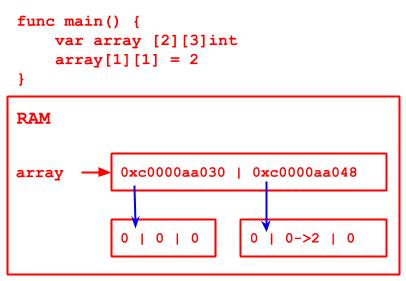

# Chapter 08 Notes - SORT and SEARCH

## Sort

internal sort - small data amount LOAD TO RAM  
external sort - large data amount NEED USE FILE

Switch sort

- Bubble sort
- Quick sort

etc.

## Search

1. linear search
2. binary search (sorted)

### linear search

[CHECK CODE](search01_linear/main.go)

### binary search

1. use sorted array (s->l)
2. left idx, right idx
3. FIRST, find middle index = (left + right) / 2, compare target value with midIndex value
    - if midVal > target, the target should in left part (leftIndex to midIndex - 1)
    - if midVal < target, the target should in right part (midIndex + 1 to rightIndex)
    - if midVal == target, return
    - use recursive
4. exit:
    - left > right

## 2D Array

1. 
   - Declare `var arrayName [][]dType`
   - Assign  
   - e.g. [2d array](2darray01/main.go)

2D Array in RAM  

2.
   - Declare and assign directly
   - e.g.
      - `var a [2][3]int = [2][3]int{{1, 2, 3}, {1, 2, 3}}`
      - `var a [2][3]int = [...][3]int{{1, 2, 3}, {1, 2, 3}}`
      - `var a = [2][3]int{{1, 2, 3}, {1, 2, 3}}` √
      - `var a = [...][3]int{{1, 2, 3}, {1, 2, 3}}` √
    
2D array traverse
[2d array](2darray02/main.go)

