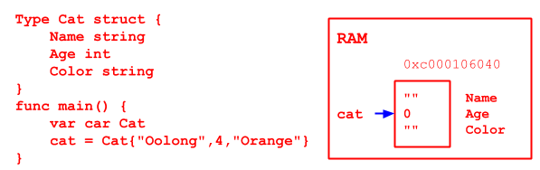
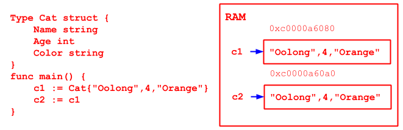
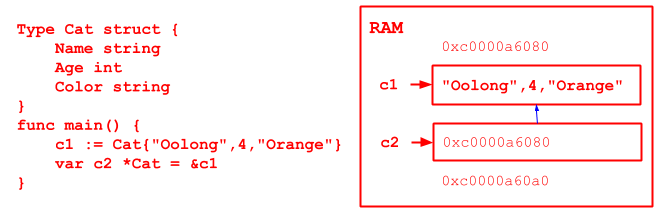
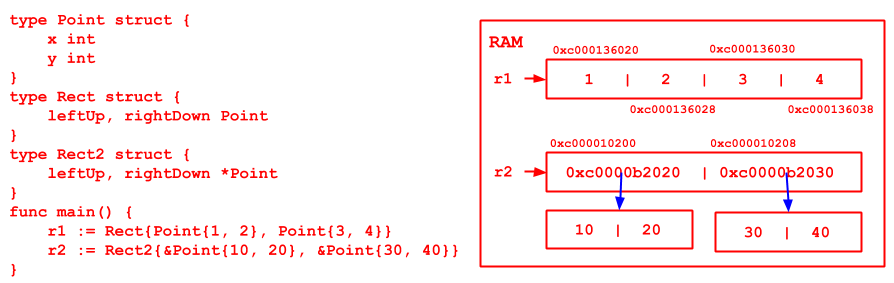
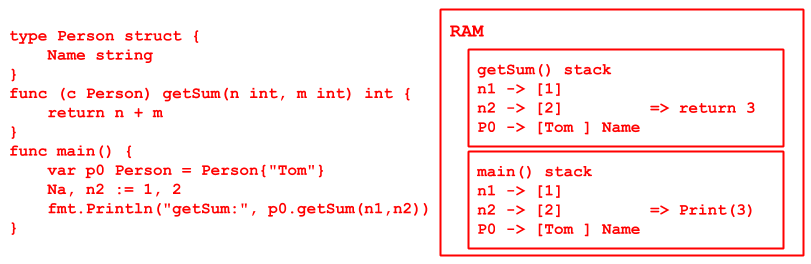
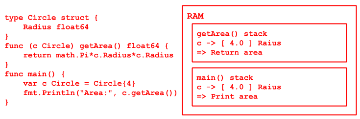
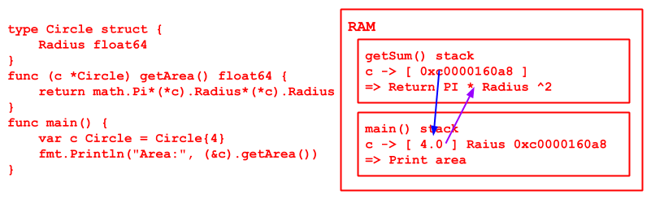

# Chapter 10 Notes - Object Oriented

## STRUCT

1. Golang supports OOP feature
2. Golang uses `struct` to realise OOP feature
3. Golang has no inherit (extends), overload, constructor，destructor, hidden this pointer etc.
4. have inheritance, encapsulation, polymorphism feature
5. Interface Oriented Programming

USE

1. extract feature of certain category of objects, to create a new custom data type ->  struct
2. create objects with the struct -> represents an object



```go
type structName struct {
    field1 type
    field2 type
}
```

### FIELD:

- field == attributes
- field could be basic data type or reference type

#### !

1. field declare: `fieldName type`
2. type of field could be basic/array/reference type
3. will use default value if not assigned after declaration
    - reference type default is `nil`
4. different struct object is identical, will not affect each other
    - struct is **VALUE** Type
    - pass by value
      

### Declare

1. `var cat Cat`
2. `var cat Cat = Cat{"Oolong", 4, "Orange"}`
    ```go
    // Assign field value when creating variable
    // 1 
    var cat Cat = Cat{"Oolong", 4, "Orange"}
    // 2 
    cat := Cat{"Oolong", 4, "Orange"}
    // 3 NOT RELY ON ORDER, SAFE TO CHANGE THE STRUCT IN FUTURE
    var cat Cat = Cat{
        Name: "Oolong", 
        Age: 4, 
        Color: "Orange",
    }
    ```
3. `var cat *Cat = new(Cat)`
     ```go
      var cat3 *Cat = new(Cat)
      (*cat3).name = "C3"
      cat3.age = 4 // Simplified
      (*cat3).color = "Ame"
      cat3.hobby = "Climb" // Simplified
      ```
4. `var cat *Cat = &Cat{}`

### allocate ram

- method 3, 4 will return struct pointer
- to assign and get value, use (*object).field
- could also use object.field // golang do transfer while compiling



!! `(*cat2.name)` // ERROR "." operator is higher than "*"

#### Detail

- all fields in a struct is continuous in RAM
    - 
- struct is a custom type, if need to convert to other type, **WIHCH REQUIRES EXACT SAME FIELDS (amount, name, type)**
- rename the struct, Golang will treat that as new type, but can force convert
    - [Check Code](struct06/main.go)
- each field could add a `tag`, and could get with reflect mechanism
    - serialization(to JSON) & deserialization
    - [Check Code](struct07_tag/main.go)

## METHOD

Method works on certain data type (bind with certain data type), so CUSTOM data type (declared with `type`) could have a
method (not only struct)

```go
type A struct {
    Num int
}

func (a A) test() { // Method belongs to type A
    fmt.Println(a.Num)
}
```

1. `func (a A) test() {}` stands for A type has a method name is test
2. test() bound to type A

[Check Code](method01/main.go)

1. test() bind to type A
2. test() could only be called by the object of type A
3. `a A` **a** represents which type A object call this method, p is a copy (pass by value)
4. `a` in 3 can be any name to represent the copy

### Principle

[Check Code](method02_eg/main.go)

- e.g.1 
- e,g,2 
- use an variable to call a method, is just like function
- when call that method, the variable will pass into the function as aparametr
    - pass value / pass reference per data type

### Declaration

```go
func (receiver type) methodName (params) (return list) {
    methodBody
    return val
}
```

### Details

1. Struct type is value type (pass by value)
2. if want to modify the value of the struct variable, use struct pointer
    - 
3. Method works on certain data type (bind with certain data type), so CUSTOM data type (declared with `type`) could
   have a method (not only struct)
    - int
    - float32
4. method scope rule is the same as function
5. if a type realise String(), fmt.Println will use the String() method to print automatically
    - [CHECK CODE](method03/main.go)
    
### Difference Between Function and Method
1. how to call
    - function: functionName(params)
    - method:   variable.methodName(params)
2. to normal function, if receiver is value type, we cannot pass by reference (pass a pointer)
3. to method (e.g. struct), if receiver is value type, we could use pointer type variable to call the method

No matter how we call the method, the key to decide pass by value or reference is decided by what the method is bound to.


## OOP

Step:
1. declare struct
2. configure struct
3. configure method

[CHECK CODE](oop_exercise/main.go)

## Factory Mode