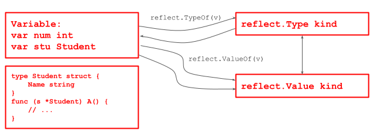

# Chapter 17 Notes - Reflection

WHEN **EXECUTING**

Usage:

1. json serialization -> use tag to mapping keyName
2. map anonymous in adapter function
3. used for framework

etc.

## Intro

1. reflection could get variable info dynamically e.g. type, kind, etc.
2. if struct, could get struct info e.g. fields, methods
3. could modify variable value, and call methods
4. use `reflect` package
5. 

- `reflect.TypeOf(var)`, get variable type, return `reflect.Type` type
- `reflect.ValueOf(var)`, get variable value, return `reflect.Value` type
    - `reflect.Value` is a struct, could get more info
- variable, empty interface and reflect.Value can be transferred
    - interface{} -> reflect.Value
        - `rVal := reflect.ValueOf(interface)`
    - reflect.Value -> interface {}
        - `iVal := rVal.Interface()`
    - interface {} -> variable
        - `interface.(variableType)` // type assertion

## Details

1. reflect.Value.Kind // a const, the kind of the value
2. Type and Kind could be same or different
    - `var a int` same
    - `var stu Student` Type: main.Student, Kind: struct
3. variable, empty interface and reflect.Value can be transferred see above
4. use reflection to get the value of the variable, need to match the variable type:
    - `reflect.Value(x).Int()`
    - struct -> type assertion
5. use reflection to modify the value
    - use SetXXX method with pointer 
    - rValue.Elem().SetXXX()
6. rValue.Elem()
    - get the value of the pointer

