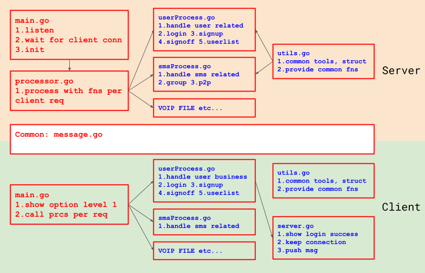
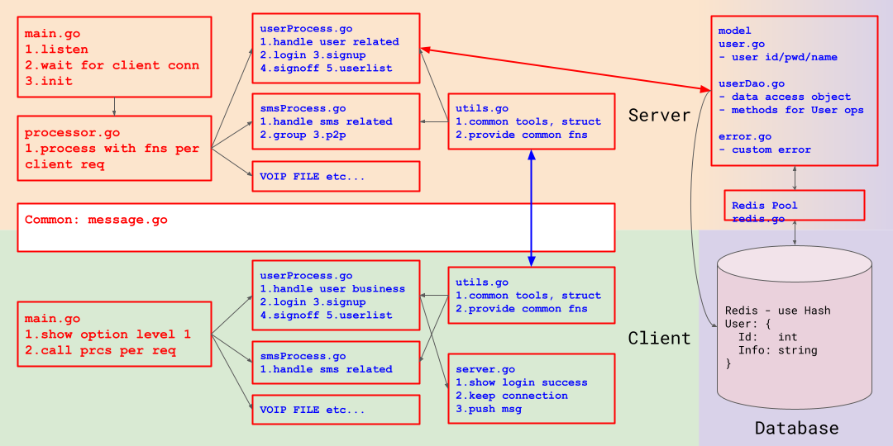
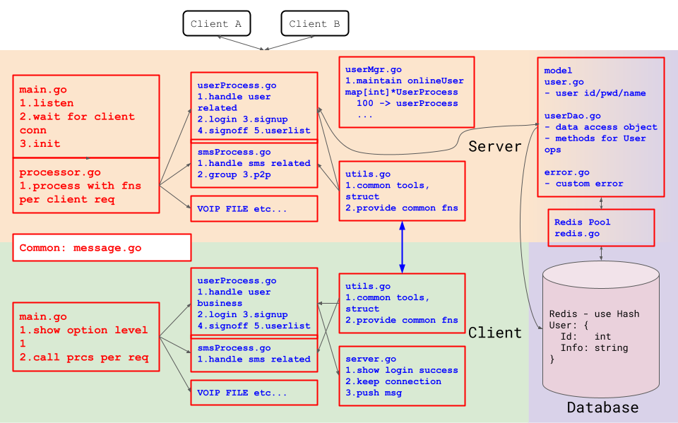
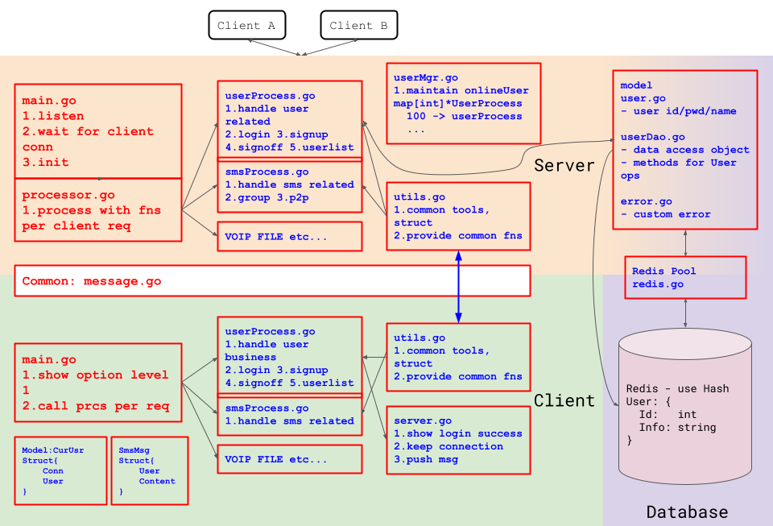

# IMS

- Client
    - Login Page
        - UI
        - sent -u -p to server
        - get success or fail, show related UI
        - design message protocal
          ```go
          Message [struct]
          ----------------
          Type string
          Data string
          ```  
          ```go
          Message Type ^
          --------------
          Login Message [struct] ^
          userId int
          userPwd string
          ...
          send as Message DATA after serialization
          ``` 
        - Send Data
            1. create `Message` struct
            2. msg.Type = Message Type
            3. msg.Data = serialized data
            4. serialize `Message` object
            5. to prevent package loss
                - send msg length
                - send msg object
- Server
    - Login
        - get -u -p from client side,
        - compare return result
        - Receive Data
            1. get data length from client side
            2. receive data according to the length
            3. check if the length of received data length equal to length received
            4. if error occurs, error correction protocol
            5. deserialize to `Message`
            6. deserialize `msg.Data.(string)`
            7. get `msg.userId`, `msg.userPwd`
            8. compare and return to client
                ```go
                Login Result
                code int // 200 404 etc.
                err string
                ```
          ...

## Code

1. Login Page
2. Login Validation
    - server 8889 listen
    - client sent data length then data
    - server check data response per condition
        - goroutine - `ServerProcessMsg`
            - call functions by message type
                - handle login `ServerProcessLogin`
                - handle signup
                - ...
    - client show UI per server response
    - COMDAT
3. Refactor
   
    1. create empty files into dirs(pkgs)
    2. refactor code into files
4. DB - Redis
   
    - redis Pool
    - userDao to connect Redis
    - use redis to validate login
5. Signup
    - sign up and save data to redis
        0. refactor user
        1. new message type in `message.go`
        2. client side get user input
        3. server side add signup in userDao
6. Fn - Return User Status after login
   
    - maintain `onlineUsers map[int]*UserProcess`
    - `userMgr.go` to CRUD
    - modify LoginMsg
        - add onlineUser slice
    - show online user list
    - push new online user msg
        - option 1: push to all if new user online
        - option 2: push at certain second
        - √ option 3: when a user online, server push the info to all online user/contact
            - 1 client need to maintain a map that records user/contact
            - 2 `map[int]User`
            - 3 `serverProcessMsg` goroutine sync server-client
7. Group Chatting
    
    - Client Send Msg
        - SmsMsg struct
        - model `CurUser`
        - smsProcess method `SendGroupMsg`
    